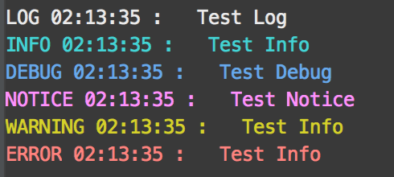

# 输出日志
 主要功能
* 按级别输出彩色日志
* 输出日志时间
* 输出单行日志

## 使用说明
示例代码
```
var log = require('logger-color');

log.setLevel('info'); // 设置输出级别
log.setColor('info','white'); // 设置颜色
log.info('log');
log.log('info');
log.debug('debug');
log.notice('notice');
log.warning('warning');
log.error('error');
log.line("line1");
log.line("line2"); // 输出单行日志，后面输出的内容将覆盖前面输出的内容
```
  

其中
- log.setLevel(level)
  只有级别大于或者等于level的日志记录才会输出
  默认级别关系 log < info < debug < notice < warning < error


- log.setColor(level,color)
  设置对应级别的输出颜色，例如log.setColor('error','origin')
  只有部分颜色可用：black，red、green、yellow、blue、magenta、cyan、white、gray、grey

  

- log.time = true;
  是否输出时间

- log.line = 'white'
  设置单行输出颜色
  
- log.line(msg)
  输出单行日志，默认level级别为info

- log.clearLine()
  清理输出的单行日志

- log.clearScreen()
  清理屏幕

- log.lineEnd()
  输出换行符

# todo：
* 配置每一个输出级别的对应数值
* 配置是否输出时间、和级别文字
* 输出调用该内容的位置
